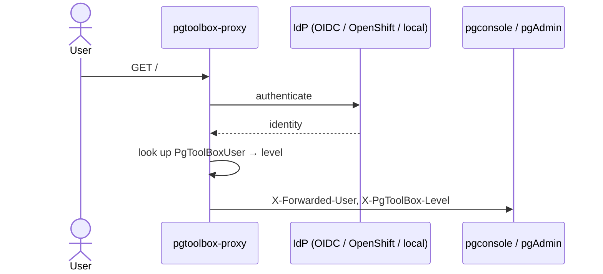

# Authentication and authorization

## The model in one sentence

The proxy authenticates and assigns a level; the console and pgAdmin trust
the proxy's headers; Kubernetes RBAC only ever constrains the console's
ServiceAccount.

## Modes

| Mode | Flow | Client identity |
|---|---|---|
| `oidc` | Authorization code + PKCE S256, state and nonce in a sealed transient cookie | rendered `clientID` + mounted client Secret |
| `openshift` | Authorization code + PKCE S256 against the integrated OAuth server | the console ServiceAccount (`system:serviceaccount:<ns>:<sa>`); its token doubles as the client secret and is read at redemption time |
| `local` | bcrypt accounts rendered from `PgToolBoxUser` | the proxy config itself |

## Levels

The proxy looks the identity up in the operator-rendered user list and
issues a session carrying one of `view`, `poweruser`, `dba`. An
unknown-but-authenticated identity gets a `none`-level session that can
reach nothing — except the 403 page's access-request form, whose CSRF token
is bound to that session.

Header hygiene: `X-Forwarded-User`, `X-PgToolBox-Level` and
`X-Forwarded-Groups` are stripped from every inbound request before
proxying, so a client can never forge them. The NetworkPolicy confines
ingress to the proxy port.

## Access requests

The 403 form POSTs to the proxy, whose only pgtoolbox-API call is
`create pgtoolboxaccessrequests`; reading and deciding requests is the
console's job (its operate Role grants read and status update). A `dba`
reviews in the console;
the operator's `PgToolBoxAccessRequest` controller materializes the
`PgToolBoxUser`, and the next proxy-config render lets the user in.
