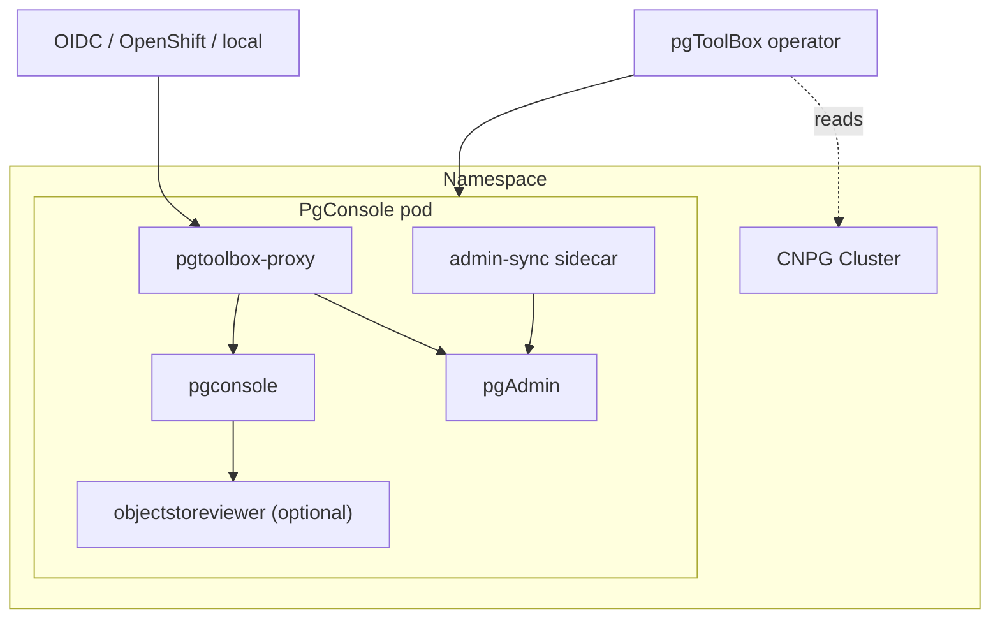

# Architecture

pgToolBox is a Kubernetes operator that manages, per CloudNativePG cluster,
a complete access stack: authentication, an observation console, and
pgAdmin — with declarative user/role provisioning.

## Components

- **pgtoolbox-proxy** — purpose-built slim OAuth2/OIDC proxy. Not an
  oauth2-proxy fork: the fork would require resurrecting htpasswd, adding
  an OpenShift provider, and carrying behavior upstream would never accept
  (operator-rendered user lists, access-request flow, level header
  injection).
- **pgconsole** — the observation UI. Kubernetes API only, never SQL, zero
  Secret access, one cluster per namespace.
- **pgAdmin** — embedded in the PgConsole pod, dedicated to the one
  cluster. Its settings DB is written only through the admin-sync
  mechanism, never rendered-and-replaced wholesale.
- **objectstoreviewer** — optional evidence sidecar, consumed over a
  pod-private Unix socket plus bearer token.

## Invariants

- CNPG 1.30+ only (`DatabaseRole` CRD always exists).
- The CNPG `Cluster` object is read-only.
- No secret material in status, logs, or events.
- Deterministic byte-stable rendering: a no-op reconcile updates nothing.
- Apps stay auth-free; the proxy is the only auth boundary and the
  generated NetworkPolicy ensures nothing bypasses it.

Deep dives: [Authentication](authentication.md),
[pgAdmin sync](pgadmin-sync.md).
